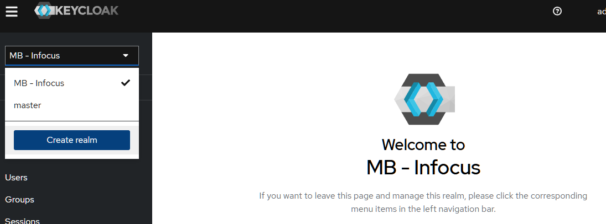
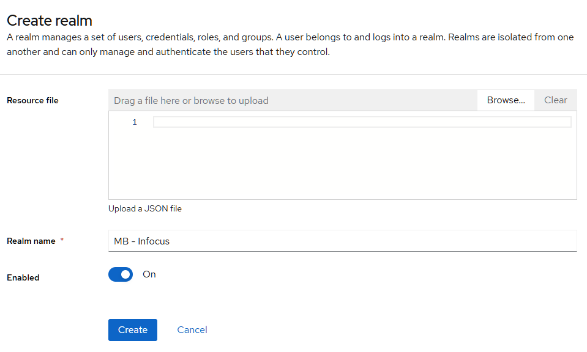
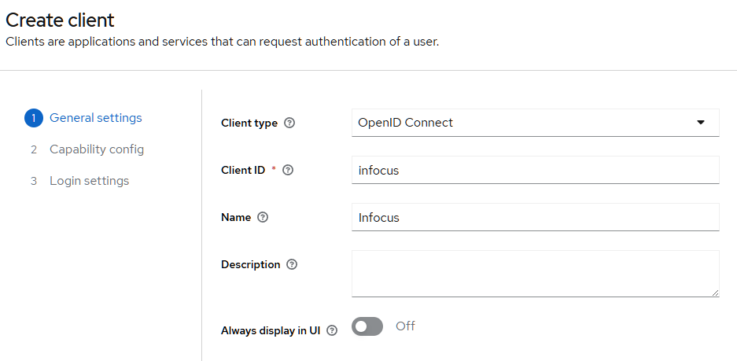
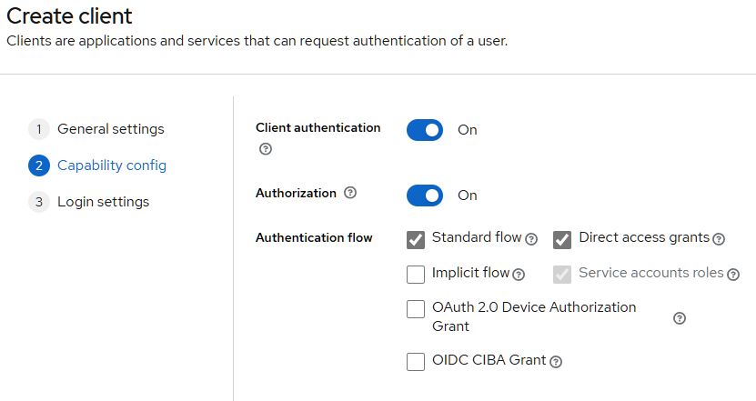
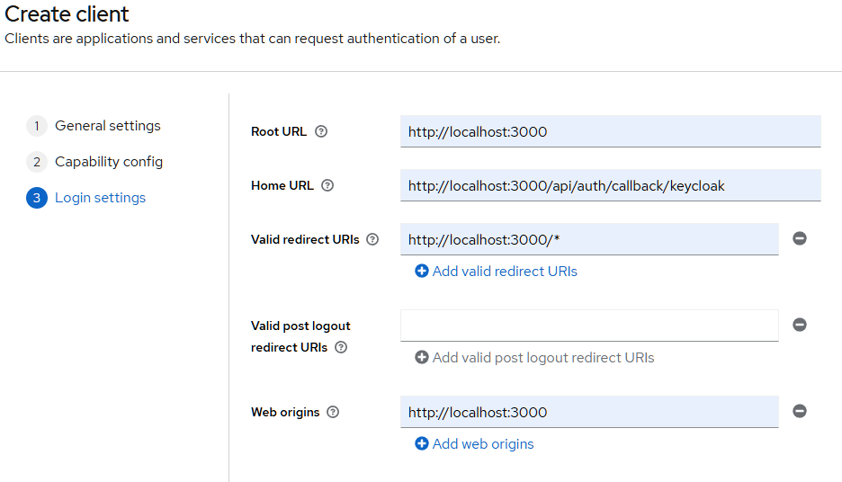
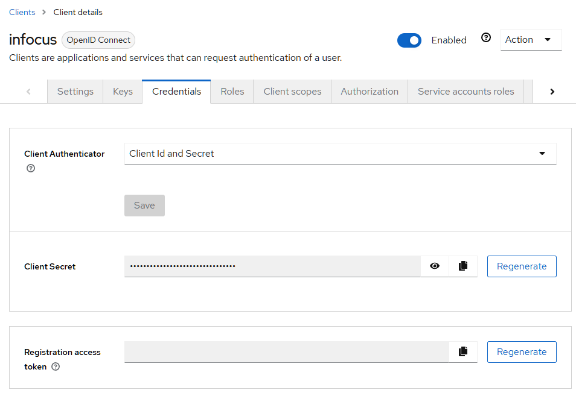

[](http://commitizen.github.io/cz-cli/)


# About

**Infocus** is a project management platform developed for Mercedes Benz to streamline the organization of building-related data. Designed to optimize the efficiency and transparency of construction processes, Infocus brings together all relevant project information into a unified digital environment. It draws inspiration from Lean Construction Management practices, similar to tools like Lindner's Lean Construction platform, allowing for a structured, collaborative approach to managing tasks and workflows. With Infocus, stakeholders can visualize project progress in real time, enhance coordination, and ultimately improve decision-making throughout the entire lifecycle of a construction project.

[[_TOC_]]

---

# Todo's

- [x] Implement husky checks for clean code
- [x] Dev environment setup
- [x] Docker setup
- [x] Keycloak setup
- [ ] Prisma setup
- [ ] Prisma migrations
- [ ] Building
- [x] Explanation internationalization / authentication / nuqs etc.

---

# Setup dev environment

Please follow the following chapters in order to setup your dev environment.

## [PNPM](https://pnpm.io/motivation)

1. Install nvm via the Symantec Management console. (If already installed skip to the next step)  
   

2. Install/Switch Node version 20.x.x  
   

3. !!!VERY IMPORTANT!!! Restart Computer

4. Check node install by entering node -v, it should return v20.x.x

5. Install pnpm via
   > npm i -g pnpm

## [Docker](https://www.docker.com/)

1. It's super simple just install docker.

2. After installation run `pnpm dev` to spinup the required docker containers (this will also start the frontend).

## [Keycloak](https://www.keycloak.org/)

Since we cannot use the Mercedes Benz PingID locally we resort to using another OpenID Connect Identity provider which in its open source form is called keycloak.

1. Navigate to http://localhost:8080/

2. Click on administration console

3. Sign in with username (admin) and password (password)

4. Click on create realm



5. Fill in the following name: `MB - Infocus` (it's important that it uses this exact form).



6. On the left side click on clients

7. Click on create client

8. Fill in the following values



9. Click next and fill in the following values



10. Click next and fill in the last following values



11. Navigate to credentials



12. Copy the secret and paste it into the environment file (.env)

```
KEYCLOAK_ID=infocus
KEYCLOAK_SECRET=<your-pasted-secret-key>
KEYCLOAK_ISSUER=http://localhost:8080/realms/MB%20-%20Infocus
```

13. The last important step is that you have to create a user in keycloak (don't forget to set a password as well).

## Prisma

TODO

---

# Folder structure

In the following you can see a small overview of the folder structure of the infocus base.

```
infocus
├── prisma/
│   └── schema.prisma -> modify this to change the datastructure
├── messages -> inside here are all the translations
├── resources -> this folder is only used for readme resources
└── src/
    ├── app/
    │   ├── [locale]/ -> for creating new views put them in here / in subfolders etc.
    │   │   └── <...here resides the standard NextJs App Router>
    │   └── api/ -> dont touch anything in here!
    │       ├── auth/
    │       │   └── [...nextauth]/
    │       │       └── route.ts
    │       └── trpc/ -> dont touch anything in here!
    │           └── [trpc]/
    │               └── route.ts
    ├── auth/ -> just don't touch anything in here!
    │   ├── authOptions.ts
    │   └── next-auth.d.ts
    ├── trpc/  -> everything trpc related lives here
    │   ├── server.tsx -> for usage with server components
    │   ├── client.tsx -> for usage with client components
    │   ├── routers/ -> add your new routers here
    │   │   ├── index.ts -> connect your new router here
    │   │   └── <...your other routers>
    │   └── i18n/ -> just dont change anything in here!
    │       └── <...don't change anything in here!>
    └── components/ -> put your custom Components / Modules in here
        └── <...if module create a separate folder else just create a file>
```

---

# Build process

TODO

---

# Release

## To trigger a new release do a pull request to the `release` branch. After completion merge the release branch into the master branch.

# Conventions

## Commits

For more informations please see [Conventional Commits](https://www.conventionalcommits.org/en/v1.0.0/)

---

# Base tech stack

## [State management]()

It is important to stay stateless in Next.js applications to achieve scalability and maintain reload-friendly functionality. To manage state effectively, we utilize `nuqs` to leverage the URL's search parameters for state storage and Next.js path parameters for contextual state, such as querying specific documents using IDs. This approach ensures that all application state is tied to the route parameters or query states, avoiding the pitfalls of classic React state management (`useState`). By embedding state in the URL through path or query parameters, we create applications that are inherently reload-friendly, scalable, and shareable, while fully utilizing Next.js's routing and dynamic capabilities.

✔️ Do's:

Use URL-based state management to maintain a fully reloadable and shareable application state:

❌ Dont's:

Avoid using React’s local state (`useState`) for managing application-critical state:

If you need more informations on how to use `nuqs` please follow this guide https://nuqs.47ng.com/

---

## [tRPC](https://trpc.io/docs/quickstart)

If you need more informations, than provided in the following chapters please read the guide under https://trpc.io/docs/quickstart

### Client usage

Just import `trpc` from `@/trpc/client` and use it like the tRPC documentation suggests.

For example:

```tsx
import { trpc } from "@/trpc/client";

export function ClientComponent() {
  // your other component stuff

  const { data, isPending } = trpc.testRouter.test.useQuery();

  // use your data
}
```

### Server usage

Just import `trpc` from `@/trpc/server` and use it like in the example.

This prefetches the query on the server and hydrates it on the client. Be sure to wrap you client component in HydrateClient otherwise it won't work.

For example:

```tsx
// inside server component

const { trpc, HydrateClient } from "@/trpc/server";

export async function ServerComponent({ children }: { children: ReactNode }) {
  // your other component stuff

  await trpc.testRouter.test.prefetch();

  return (
    <HydrateClient> // this hydrates the data to the client
      {children}
    </HydrateClient>
  );
}
```

### Routers

New routers are created inside `src/trpc/routers` they always have the following structure:

```tsx
import { router, protectedProcedure } from "..";

const testRouter = router({
  testQuery: protectedProcedure.query(async () => {
    // your query logic -> should always return something
  }),
  testMutation: protectedProcedure.mutation(async () => {
    // your mutation logic -> should also always return something
  }),
});

export default testRouter;
```

To connect a new router update the `index.ts` file as follows:

```tsx
import "server-only";

import { router } from "..";

// other router imports
import testRouter from "./testRouter"; // this is your new router

export const appRouter = router({
  // other routers
  testRouter, // only change this!
});

export type AppRouter = typeof appRouter;
```

---

## [i18n](https://next-intl-docs.vercel.app/docs/usage)

Follow this guide if you need help https://next-intl-docs.vercel.app/docs/usage

The locale Provider is already setup, the only thing you should have to use is the `useTranslations` hook. Locale messages are present under `messages/*.json`.

---

## [next-auth](https://next-auth.js.org/)

You should only use the `useSession()` hook, and if you need the session inside of a server component. If you need more infos please read the following guide https://next-auth.js.org/

> "Never roll your own auth!" (or suffer)

---

## prisma

For more informations on how to use prisma please follow this guide https://www.prisma.io/docs/orm

### Transactions

Using Prisma dynamic transactions ensures that all database operations within a transaction are either fully completed or rolled back in case of an error, maintaining data integrity and preventing inconsistent states. This is critical for workflows involving multiple dependent actions, such as creating a user and associated records, where partial failures could lead to orphaned or conflicting data. Dynamic transactions also simplify error handling, allowing developers to manage edge cases and exceptions more effectively.

```typescript
import prisma from "<prisma instance>";

async function createOrderWithItems(orderData, items) {
  return await prisma.$transaction(async (tx) => {
    const order = await tx.order.create({ data: orderData });
    await Promise.all(
      items.map((item) =>
        tx.orderItem.create({
          data: { ...item, orderId: order.id },
        })
      )
    );
    return order;
  });
}

// Error during an item creation rolls back the entire operation
```

### Migration

Todo

---

## Material-UI

For more informations on MaterialUI please follow this guide https://mui.com/material-ui/getting-started/usage/

---

# VSCode extensions

The following extensions should be used to make developing easier:

- Mandatory:

  - ESLint (for tracking warnings and possible errors)
  - Prettier - Code formatter (for automatic codestyling)
  - Prisma (for easier editing of prisma.schema file)
  - Todo Tree (for tracking todos)
  - i18n Ally (for internationalisation)
  - Visual Studio Code Commitizen Support (for easier usage of conventional commits)

- Optional:
  - Pretty typescript errors (for better typescript error readability)

---
